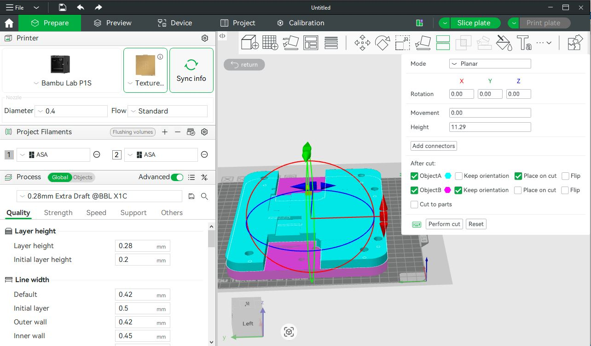

# ELR-Mounting-Plate
A rugged, mounting solution for securely attaching electronic hit indicators to steel targets in extreme long-range (ELR) shooting setups. Designed for durability, repeatability, and easy integration with common target systems.

